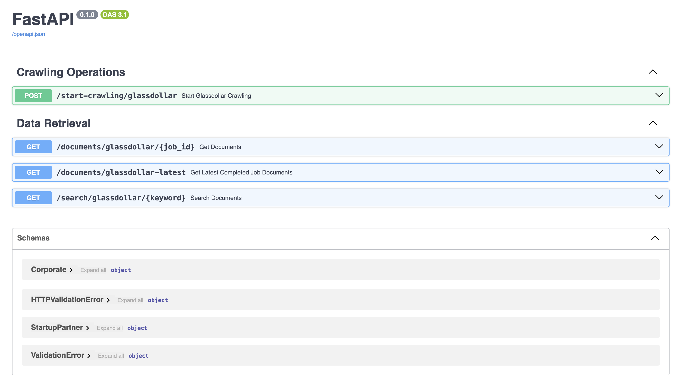
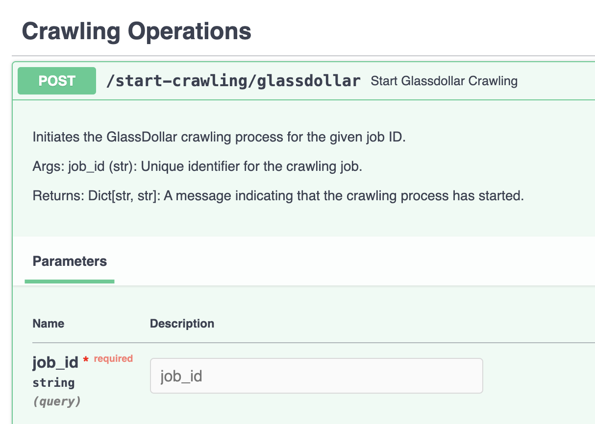
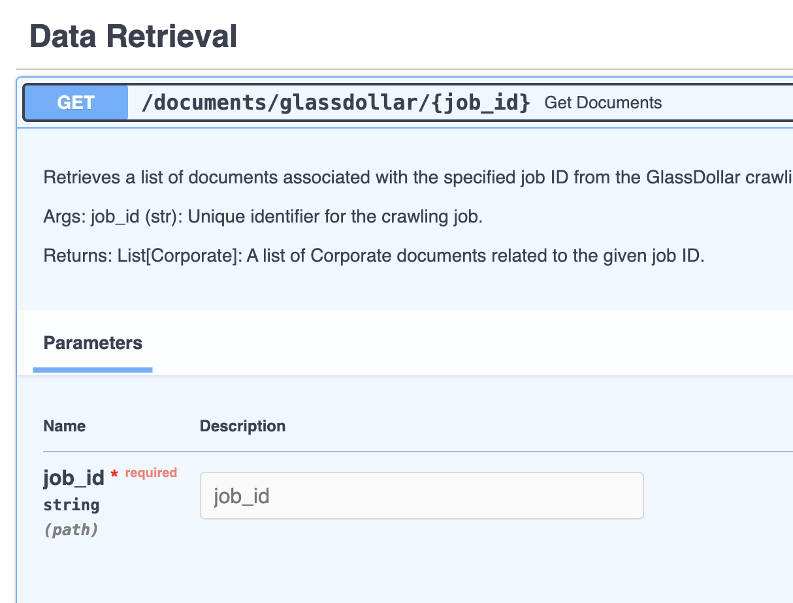

# Crawling-App

## Overview
This application is specifically designed for efficient crawling of the [GlassDollar Ranking website](https://ranking.glassdollar.com).

## Getting Started

### Running the Application
Execute the application using Docker. You can adjust the number of Celery workers based on your needs. Here's the command to get you started:

```sh
docker-compose up --scale celery=10
```


## Application Components

### Crawl Initiation
Start the crawl with a command and a unique job ID. This ID is vital for initiating the process. 

### Result Retrieval
Use the same job ID to access and collect the crawl results.

### 🔑 Job ID Importance
The job ID is crucial for both starting the crawl and accessing results. Keep it accessible!









### Data Models

```javascript
// Example of a Job document
{
    "_id" : ObjectId("6577be5d6ba5f95dba564c46"),
    "job_id" : "2",
    "total_corporate_count" : NumberInt(847),
    "created_at" : ISODate("2023-12-12T01:58:53.615+0000"),
    "counter" : NumberInt(847)
}

// Example of a Corporate document
{
    "_id" : ObjectId("6577bcf3eb34a56785e95947"),
    "id" : "ace7c133-b21c-9aa8-a8a5-c06d7d6f9232",
    "name" : "Swisscom",
    "description" : "Switzerland’s leading telecom provider",
    "logo_url" : "https://logo.clearbit.com/www.swisscom.ch",
    "hq_city" : "Worblaufen",
    "hq_country" : "Switzerland",
    "website_url" : "https://www.swisscom.ch/",
    "linkedin_url" : "https://www.linkedin.com/company/swisscom/",
    "twitter_url" : null,
    "startup_partners_count" : NumberInt(14),
    "startup_partners" : [
        {
            "company_name" : "Acodis",
            "logo_url" : "https://res.cloudinary.com/crunchbase-production/image/upload/duwzk7n0vbcih5jxraym",
            "city" : "Winterthur",
            "website" : "acodis.io",
            "country" : "Switzerland",
            "theme_gd" : "Artificial Intelligence, Machine Learning"
        },
        {
            "company_name" : "Onedot",
            "logo_url" : "https://crunchbase-production-res.cloudinary.com/image/upload/c_lpad,h_120,w_120,f_jpg/v1507052712/jzip1o0ie85iuz00kwzk.png",
            "city" : "Zürich",
            "website" : "onedot.com",
            "country" : "Switzerland",
            "theme_gd" : "Digital Transformation"
        },
        {
            "company_name" : "Desk-Net",
            "logo_url" : "https://crunchbase-production-res.cloudinary.com/image/upload/c_lpad,h_120,w_120,f_jpg/v1397182506/df5df786f582eda1f5d7a2426ce91980.jpg",
            "city" : "Hamburg",
            "website" : "desk-net.com",
            "country" : "Germany",
            "theme_gd" : "Digital Transformation"
        },
        {
            "company_name" : "Bivocom Technologies",
            "logo_url" : "https://crunchbase-production-res.cloudinary.com/image/upload/c_lpad,h_120,w_120,f_jpg/htabmzh3ajo92karjj1j",
            "city" : "Xiamen",
            "website" : "bivocom.com",
            "country" : "China",
            "theme_gd" : "Industry 4.0"
        },
        {
            "company_name" : "Pluribus Networks",
            "logo_url" : "https://crunchbase-production-res.cloudinary.com/image/upload/c_lpad,h_120,w_120,f_jpg/v1450821362/dixkifvrcei6c6nbocxd.png",
            "city" : "Santa Clara",
            "website" : "pluribusnetworks.com",
            "country" : "United States",
            "theme_gd" : "Automation"
        },
        {
            "company_name" : "GetLeedz",
            "logo_url" : "https://crunchbase-production-res.cloudinary.com/image/upload/c_lpad,h_120,w_120,f_jpg/irfalja0llxpfcpsnpsj",
            "city" : "Binningen",
            "website" : "getleedz.com",
            "country" : "Switzerland",
            "theme_gd" : "MarTech"
        },
        {
            "company_name" : "ffly4u",
            "logo_url" : "https://crunchbase-production-res.cloudinary.com/image/upload/c_lpad,h_120,w_120,f_jpg/petd1xrxaaepcig0qjkh",
            "city" : "Toulouse",
            "website" : "ffly4u.com",
            "country" : "France",
            "theme_gd" : "Digital Transformation"
        },
        {
            "company_name" : "Imply",
            "logo_url" : "https://crunchbase-production-res.cloudinary.com/image/upload/c_lpad,h_120,w_120,f_jpg/w9wwv5pecrvnbehyoxvk",
            "city" : "Burlingame",
            "website" : "imply.io",
            "country" : "United States",
            "theme_gd" : "Automation"
        },
        {
            "company_name" : "WealthArc",
            "logo_url" : "https://crunchbase-production-res.cloudinary.com/image/upload/c_lpad,h_120,w_120,f_jpg/v1o9lkpnhuskqhhqqv4m",
            "city" : "Zürich",
            "website" : "wealtharc.com",
            "country" : "Switzerland",
            "theme_gd" : "Automation"
        },
        {
            "company_name" : "Deepomatic",
            "logo_url" : "https://crunchbase-production-res.cloudinary.com/image/upload/c_lpad,h_120,w_120,f_jpg/v1496918181/z4hfbejvmfa4xhwi8cdb.png",
            "city" : "Paris",
            "website" : "deepomatic.com",
            "country" : "France",
            "theme_gd" : "Automation, Digital Transformation"
        },
        {
            "company_name" : "Exicon",
            "logo_url" : "https://crunchbase-production-res.cloudinary.com/image/upload/c_lpad,h_120,w_120,f_jpg/v1414377444/d0tik04rjjl87jqrp1ky.png",
            "city" : "Kwai Tsing",
            "website" : "exiconglobal.com",
            "country" : "Hong Kong",
            "theme_gd" : "Digital Transformation"
        },
        {
            "company_name" : "IoTM",
            "logo_url" : "https://crunchbase-production-res.cloudinary.com/image/upload/c_lpad,h_120,w_120,f_jpg/odq4z6u3cqtnhccle0x2",
            "city" : "Ramat Hasharon",
            "website" : "iotm.mobi",
            "country" : "Israel",
            "theme_gd" : "Automation"
        },
        {
            "company_name" : "initPRO",
            "logo_url" : "https://crunchbase-production-res.cloudinary.com/image/upload/c_lpad,h_120,w_120,f_jpg/3eea9f36b0a962cf4702",
            "city" : "Regensburg",
            "website" : "initpro.de",
            "country" : "Germany",
            "theme_gd" : "Digital Transformation"
        },
        {
            "company_name" : "Crafting Future GmbH",
            "logo_url" : "https://crunchbase-production-res.cloudinary.com/image/upload/c_lpad,h_120,w_120,f_jpg/frqp2jujgg38wg863tkn",
            "city" : "Hanover",
            "website" : "craftingfuture.de",
            "country" : "Germany",
            "theme_gd" : "Other"
        }
    ],
    "startup_themes" : [
        [
            "Digital Transformation",
            "6"
        ],
        [
            "Automation",
            "5"
        ],
        [
            "Artificial Intelligence",
            "1"
        ],
        [
            "Machine Learning",
            "1"
        ],
        [
            "Industry 4.0",
            "1"
        ],
        [
            "MarTech",
            "1"
        ],
        [
            "Other",
            "1"
        ]
    ],
    "job_id" : "1",
    "created_at" : ISODate("2023-12-12T01:52:51.608+0000")
}
```

